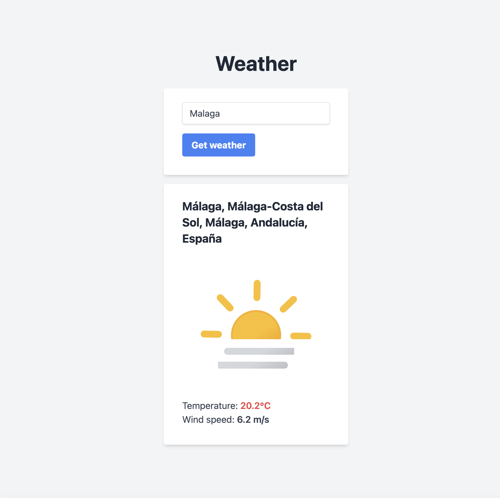

# Weater Demo

- Go
    - No dependencies
- HTMX

## Installing dependencies
On mac
~~~console
brew install go
~~~

On other operating sytems, see https://go.dev/doc/install

## How to run
~~~console
go run cmd/main/main.go
~~~

## API'es used
- Get city coordinates based on query: https://nominatim.org/release-docs/latest/api/Search/
- Get weather based on coordinates: https://api.met.no/
- Dynamically search for icons: https://iconify.design/

